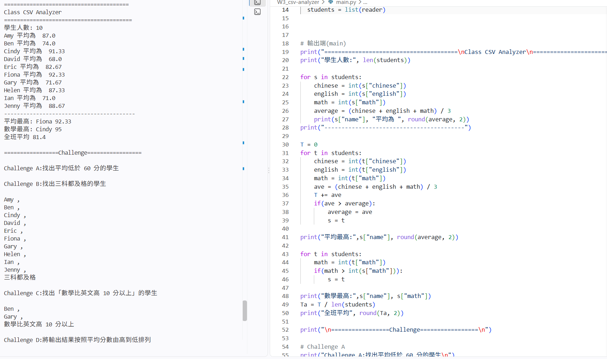

# W3

## 作品名稱

**Csv-Analyzer**

## 我要解決的問題

- 使用 Python 讀取 CSV 班級資料，並進行成績分析。
- 顯示學生資料 / 計算平均 / 找出最高分

## 使用到的技術

###  Python / CSV / csv.DictReader / list / dictionary / for / if / with open 

## 我遇到的問題與如何解決

### 1. 讀取資料

使用 `with open()` 時，需要使用`cd 資料層`將讀取層改為 example.csv 存在層。

## 我學到了什麼

### CSV 基礎

- 理解 **.CSV** 的建立與讀取方式

### 字典dictionary

- 了解字典資料的提取、儲存、及使用`int()`轉整數計算

## 執行結果

— By 邱冠元 2026/9/30
